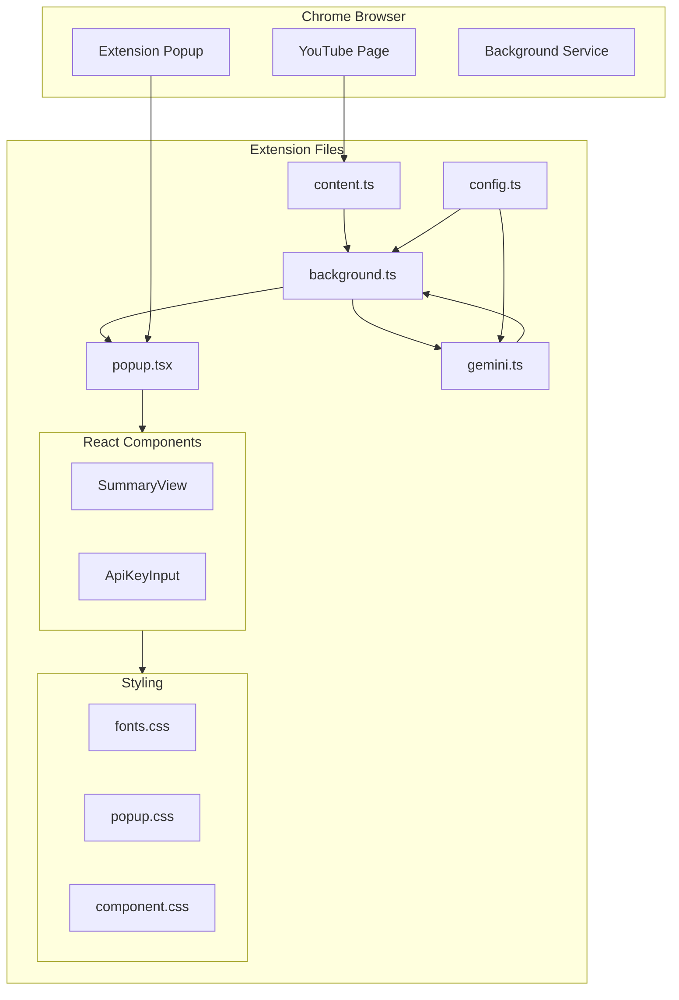
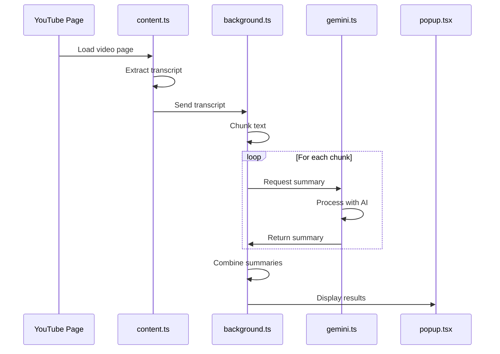
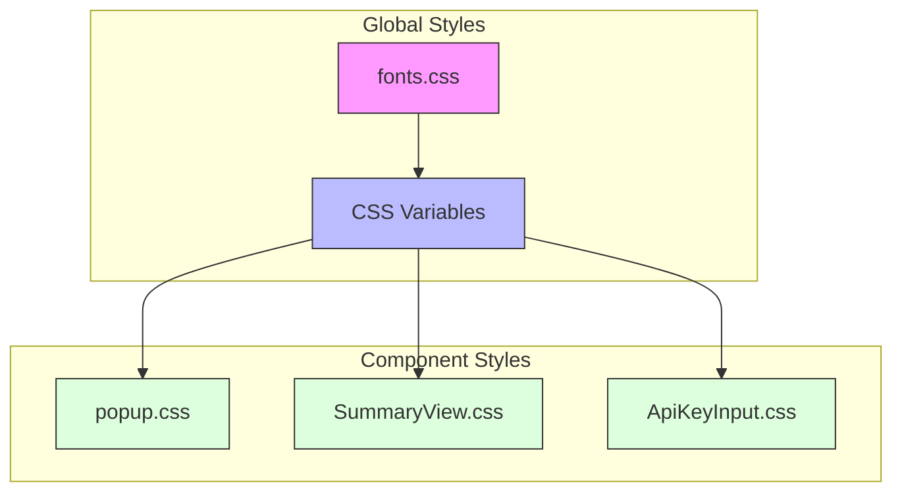

# YouTube Summarizer Chrome Extension Architecture

## Architecture Diagrams

### Component Architecture


### Data Flow Diagram


### Styling Architecture


## Overview
This Chrome extension uses a modern architecture to summarize YouTube videos using the Gemini AI model. Here's how the different components work together:

## 📚 Important Guides

- **[QUICK_START.md](QUICK_START.md)** - Quick setup and dependency updates
- **[DEPENDENCY_UPDATE_GUIDE.md](DEPENDENCY_UPDATE_GUIDE.md)** - Comprehensive dependency management
- **[RATE_LIMITS_GUIDE.md](RATE_LIMITS_GUIDE.md)** - ⭐ Understanding & fixing rate limit errors
- **[architecture.md](architecture.md)** - Detailed architecture documentation

### Having Issues?

**"Rate limit exceeded" error?** → See [RATE_LIMITS_GUIDE.md](RATE_LIMITS_GUIDE.md)  
**Need to update dependencies?** → See [QUICK_START.md](QUICK_START.md)  
**Extension not working?** → Check the Debugging section below

## Core Components

### 1. Extension Entry Points

#### `popup.tsx` & `popup.css`
- **Purpose**: Main user interface of the extension
- **Functionality**: 
  - Renders when users click the extension icon
  - Manages the main app container and routing
  - Imports global styles and theme
- **Key Dependencies**: React, Components from `/components`

#### `background.ts`
- **Purpose**: Background service worker
- **Functionality**:
  - Runs in the background continuously
  - Manages API key storage
  - Handles communication between content script and popup
  - Initializes Gemini service
  - Manages video state and summarization process

#### `content.ts`
- **Purpose**: Content script injected into YouTube pages
- **Functionality**:
  - Extracts video transcripts
  - Communicates with background script
  - Handles video page interactions
  - Manages transcript processing and chunking

### 2. Services Layer (`/services`)

#### `gemini.ts`
- **Purpose**: Handles all Gemini AI interactions
- **Functionality**:
  - Manages API authentication
  - Handles model selection and fallbacks
  - Processes text summarization requests
  - Manages rate limiting and retries

### 3. Components (`/components`)

#### `ApiKeyInput/`
- **Purpose**: Manages API key input and validation
- **Files**:
  - `ApiKeyInput.tsx`: Component logic
  - `ApiKeyInput.css`: Component styles

#### `Popup/`
- **Purpose**: Main popup interface components
- **Files**:
  - `SummaryView.tsx`: Summary display component
  - `SummaryView.css`: Summary styling
  - Other popup-related components

### 4. Styling System (`/styles`)

#### `fonts.css`
- **Purpose**: Global typography and design system
- **Defines**:
  - Font imports (Rubik)
  - Color variables
  - Spacing system
  - Typography scale
  - Shadow styles
  - Border radius values

### 5. Configuration (`config.ts`)
- **Purpose**: Global configuration settings
- **Contains**:
  - AI model settings
  - Default parameters
  - Feature flags

## Data Flow

1. **User Interaction Flow**:
   ```
   YouTube Page → content.ts → background.ts → Gemini API → popup.tsx
   ```

2. **Summarization Process**:
   ```
   content.ts (extract transcript)
   → background.ts (chunk management)
   → gemini.ts (API calls)
   → background.ts (result processing)
   → popup.tsx (display results)
   ```

3. **Styling Hierarchy**:
   ```
   fonts.css (global design system)
   → popup.css (global styles)
   → [component].css (component-specific styles)
   ```

## Key Features

### 1. AI Integration
- Uses Gemini AI models with fallback options
- Handles rate limiting and quotas
- Manages API key securely

### 2. User Interface
- Modern, responsive design
- Clear visual hierarchy
- Consistent typography with Rubik font
- Interactive elements with hover states
- Loading states and error handling

### 3. Performance
- Background processing
- Chunked transcript handling
- Efficient state management
- Caching mechanisms

## Development Workflow

### Quick Setup & Updates

**New to the project or returning after a while?**

```bash
# Quick start - updates dependencies and tests build
node scripts/quick-start-updates.js
```

**Available Scripts:**
- `npm run build` - Production build
- `npm run dev` - Development build with watch mode
- `npm run type-check` - TypeScript type checking
- `npm run lint` - Lint TypeScript/React code
- `npm run lint:fix` - Auto-fix linting issues
- `npm run generate-icons` - Generate extension icons
- `npm run clean` - Remove build directory

**Maintenance Scripts:**
- `node scripts/update-dependencies.js` - Update safe dependencies
- `node scripts/cleanup-project.js` - Clean up project files
- `node scripts/generate-icons.js` - Generate icon files

📖 **See [QUICK_START.md](QUICK_START.md) for dependency updates**  
📖 **See [DEPENDENCY_UPDATE_GUIDE.md](DEPENDENCY_UPDATE_GUIDE.md) for detailed update info**

### Building

1. **Development Build**:
   ```bash
   npm run dev
   ```
   - Compiles TypeScript
   - Bundles with webpack
   - Watches for changes
   - Source maps enabled

2. **Production Build**:
   ```bash
   npm run build
   ```
   - Optimized bundle
   - Generates dist/ directory
   - Ready for Chrome Web Store

### Testing

1. **Load Extension**:
   - Open `chrome://extensions/`
   - Enable "Developer mode"
   - Click "Load unpacked"
   - Select `dist/` folder

2. **Test Functionality**:
   - Navigate to a YouTube video
   - Click extension icon
   - Add Gemini API key
   - Try summarizing

### Debugging

- **Background Script**: `chrome://extensions/` → Extension details → Inspect service worker
- **Popup**: Right-click extension icon → Inspect popup
- **Content Script**: Open DevTools on YouTube page
- **Console**: Check for error messages in all contexts

## Best Practices

1. **State Management**
   - Clear data flow
   - Centralized configuration
   - Type safety with TypeScript

2. **Styling**
   - CSS variables for consistency
   - Component-scoped styles
   - Responsive design patterns

3. **Security**
   - Secure API key storage
   - Safe message passing
   - Input validation 