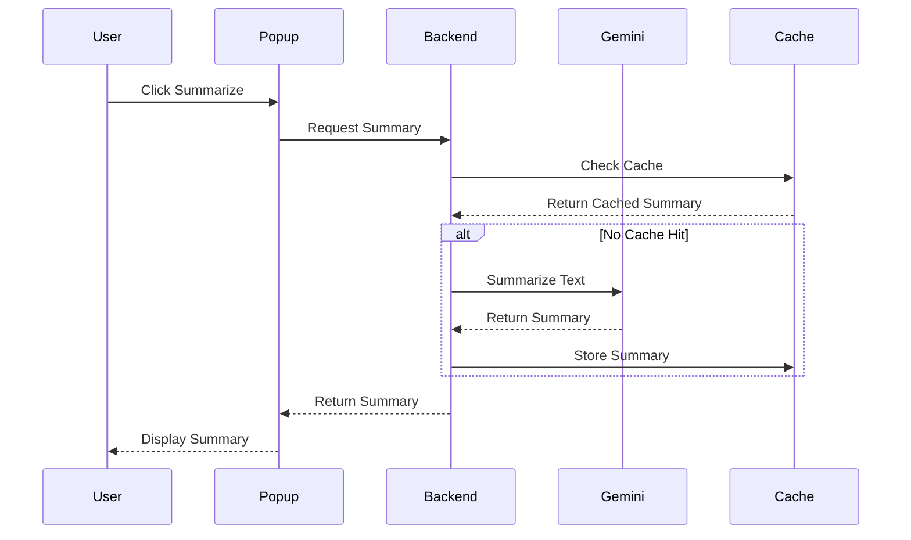

# YouTube Video Summarizer Architecture

## Directory Structure

```
youtube-summarizer/
├── src/
│   ├── components/
│   │   ├── ApiKeyInput/
│   │   ├── Common/
│   │   └── Popup/
│   ├── services/
│   │   ├── gemini.ts         # Gemini AI integration
│   │   └── cache.ts          # Caching service
│   ├── types/
│   │   └── index.ts          # TypeScript type definitions
│   ├── background.ts         # Extension background service
│   ├── content.ts           # Content script for YouTube pages
│   └── popup.tsx            # Extension popup UI
├── public/
│   ├── icons/
│   │   └── ...              # Extension icons
│   └── popup.html           # Popup HTML template
└── dist/                    # Built extension files
```

## Component Flow



## Core Components

1. **Popup UI**
   - React-based user interface
   - Handles API key input and validation
   - Displays video metadata and summary
   - Provides export options

2. **Background Service**
   - Manages extension state
   - Handles message routing
   - Coordinates between components
   - Manages API key storage

3. **Content Script**
   - Injects into YouTube pages
   - Extracts video metadata
   - Retrieves video transcripts
   - Communicates with background service

4. **Gemini Service**
   - Handles API authentication
   - Manages API requests
   - Processes transcripts
   - Generates summaries
   - Implements retry logic

5. **Cache Service**
   - Stores summaries locally
   - Implements cache expiration
   - Manages storage limits
   - Provides fast retrieval

## Data Flow

1. User navigates to YouTube video
2. Content script detects video and extracts metadata
3. User clicks "Summarize" in popup
4. Background service checks cache for existing summary
5. If not cached, requests Gemini summary
6. Summary is cached and displayed to user
7. User can export summary in different formats
